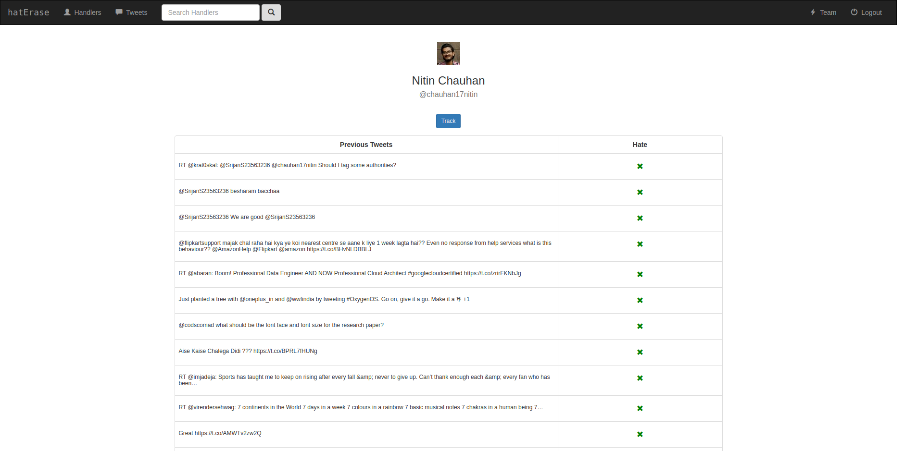
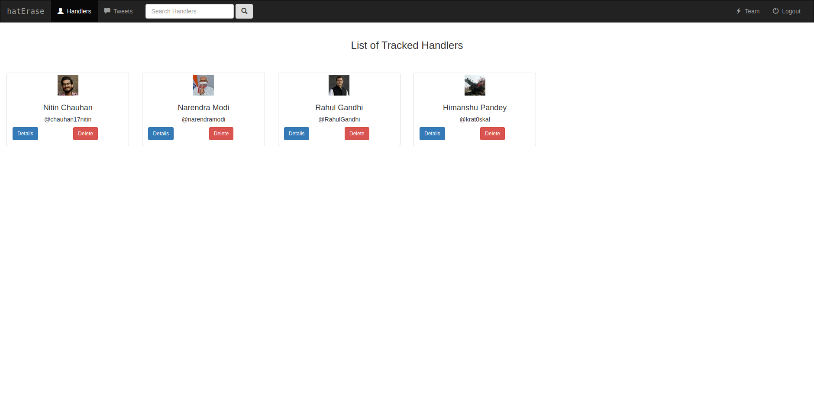
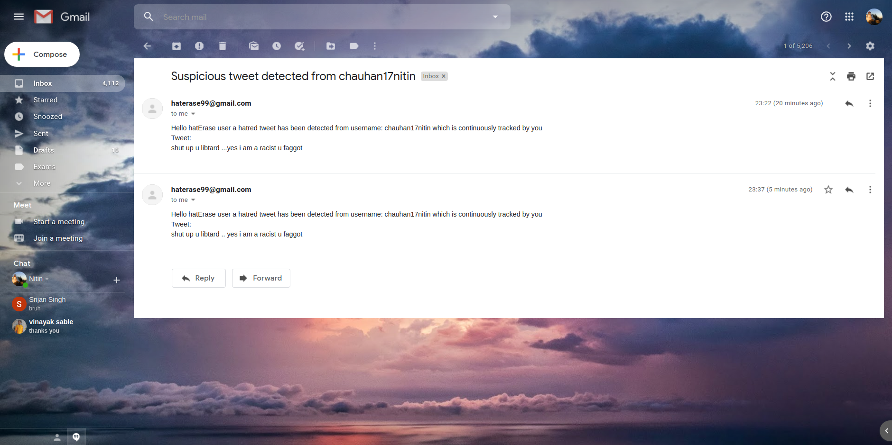

# hatErase
Realtime twitter hate speech  detection

**This branch contains the codebase for the deployment part of machine learning models in a webapp using Django**

*For class based views refer webapp and for functions based views refer webapp-test*
**webapp is not up to date so refer webapp-test**

To run the webapp on local server
```
cd /path/to/manage.py

python manage.py runserver
```


# Images
**Search**


**Tracks**


**Mail**


## Hate Score prediction
documentation goes here

## Hate Tweet Tracking
documentation goes here
