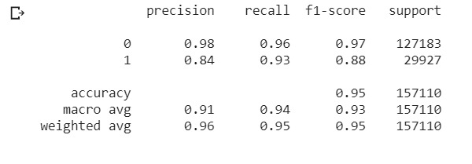

# hatErase
Realtime twitter hate speech  detection

**This is the master branch of the repo it contains the codebase of Machine Learning approach that we followed to train our Model**

**The other branch is webapp which contains the codebase for deployment part mainly**

## Dataset Collection

We used different open source datasets, from different hackathons and competetions and combined them to make a bid dataset which containes variety of tweets the dataset majorly focuses on English Language
[Dataset Exploration](Dataset_Exploration.ipynb) has the code for all the exploration part of dataset and how we concatenated them.

## Dataset Preprocessing

[Dataset Preprocessing](dataset_preprocess.ipynb) contains the code of how we cleaned the dataset as it can not be directly fed to the Machine Learning Models. How different techniques we used to useful features from the text like hashtags, user mentions etc.

## Machine Learning Models
We trained our model using two prominent ML algorithms for Binary Classification, namely - [Multinomial Naive Bayes](MNB_training.ipynb) and [Logistic Regression](LR_training.ipynb).

The final model was saved based on training LR with n-grams of range (1,3) as lexical features.

The trainingg set classification report was:

The Test set classification report was:

The AUC-ROC curve for test set was:

## Hate Score prediction
documentation goes here

## Contributed By
[Nitin Chauhan](https://github.com/hammer1234567) and [Srijan Singh](https://github.com/srijansingh53)
